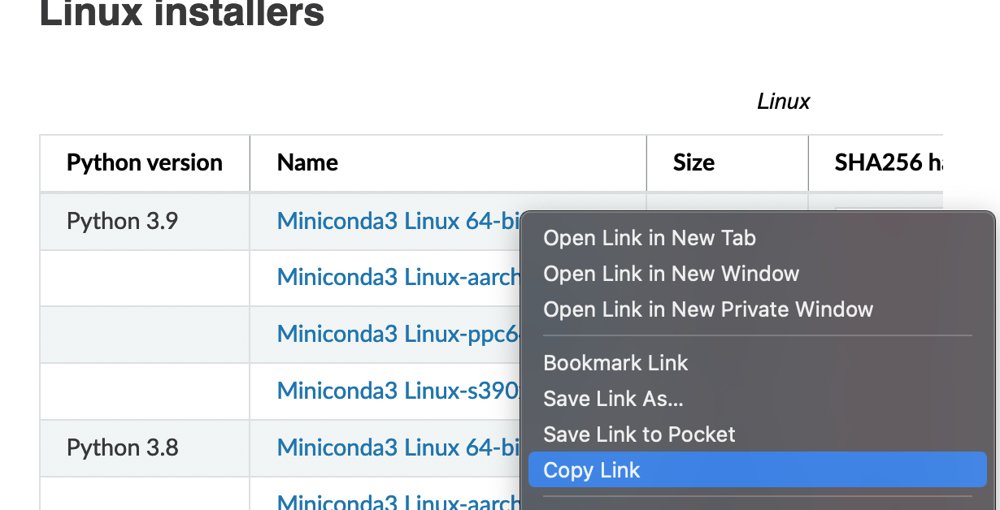

# Using Python on the cluster

When using Python, you may find you need to use various libraries (e.g., numpy for numerical analysis or matplotlib for plotting). 
Installing and managing these different libraries and their dependencies can be problematic, especially when you run into conflicts.
Conda is a package manager that helps you create and naviagate "environments" to help automatically handle these conflicts. 
To learn more, we recommend this [introduction to conda](https://docs.conda.io/projects/conda/en/latest/user-guide/getting-started.html) or this [conda tutorial](https://carpentries-incubator.github.io/introduction-to-conda-for-data-scientists/).

## Installing conda

For using conda on the clusters, we recommend [Miniconda](https://docs.conda.io/en/latest/miniconda.html#linux-installers).
To install Miniconda, select one of the download links on that page (for R2 and Borah choose Linux 64-bit architecture), right-click the link, and select copy link.



Then paste that link into the terminal to download the installer script: (replace `PASTE_LINK_HERE` with the link you copied) 
```bash
wget PASTE_LINK_HERE
```

And run the installer script: (replace `USE_DOWNLOADED_FILENAME_HERE` with the name of the file you downloaded usually something starting with "Miniconda" and ending with ".sh"
```
bash USE_DOWNLOADED_FILENAME_HERE
```

For example:
```bash
wget https://repo.anaconda.com/miniconda/Miniconda3-py39_4.12.0-Linux-x86_64.sh
bash Miniconda3-py39_4.12.0-Linux-x86_64.sh
```

The following prompts will ask you if the default installation location (typically in your home directory) is alright (it is) and whether you want to initialize conda each time you log in (generally a good idea).

## Creating a conda environment

Now that you've installed conda, let's create an environment.
The following command tells conda to create an environment called "climate" that pulls from the conda-forge channel with the packages matplotlib and numpy: 
```bash
conda create -n climate -c conda-forge matplotlib numpy
```

Once this environment is created, it can be activated using the following command:
```bash
conda activate climate
```

Conda is a powerful tool with many different ways it can be used, to learn more check out the [conda user guide](https://docs.conda.io/projects/conda/en/latest/user-guide/index.html).

## Using a conda environment with Open OnDemand

[Open OnDemand](https://openondemand.org/) is a tool which provides users with a graphical interface to the cluster. Currently Open OnDemand is only available for R2: [https://r2-gui.boisestate.edu](https://r2-gui.boisestate.edu)

In order to use your conda environment in a Jupyter Notebook through Open OnDemand, you'll need to install some additional packages. With the conda environment you want to use activated, install `jupyter` and `ipykernel`:
```bash
conda install jupyter ipykernel
```

Then run ipykernel to create the custom Jupyter kernel: (replace `ENVIRONMENT_NAME` with the environment name and `PYTHON ENV NAME` with the name you will select for the kernel)
```bash
python -m ipykernel install --user --name ENVIRONMENT_NAME --display-name "PYTHON ENV NAME"
```

Then navigate to the Jupyter Notebook App on [https://r2-gui.boisestate.edu](https://r2-gui.boisestate.edu):


Once your Jupyter session starts, select the kernel you just made (It will be listed under the name you put in `PYTHON ENV NAME` the example below shows a kernel named "climate"):


