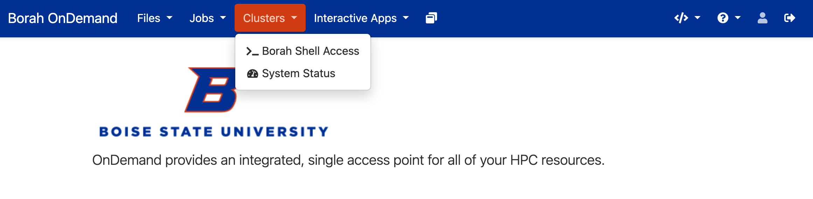

# Logging In
After getting your account from Research Computing, please navigate to
[ondemand.boisestate.edu](https://ondemand.boisestate.edu){:target="_blank"}, choose your
university as the identity provider, and log in with your university
credentials.

Once connected to Borah through OnDemand, you can access a terminal, view your
files, access an IDE or Jupyter notebook, and much more!
[More information about OnDemand](open_ondemand.md).

## SSH
To connect to the cluster via Secure Shell (SSH) you will need to find/install
a terminal application, set up your SSH keys, and be connected to the Boise
State network.
!!! warning "Important VPN Notice"

    You can only connect to the cluster via SSH while on campus or connected to the [Boise State VPN](https://www.boisestate.edu/oit/network/vpn-services/){:target="_blank"}.
    All active university faculty, staff, and student employees have access to Boise State’s VPN service.
    Students and affiliates can get access per their instructor's or affiliate sponsor's request.
    Please reach out to the [Help Desk](https://www.boisestate.edu/oit/assistance) to request access or get help using the VPN.

### Terminal
Your terminal application varies depending on your operating system:

#### Windows:

There are many options, but we recommend MobaXTerm for terminal access on Windows.
Go to the [MobaXTerm download page](https://mobaxterm.mobatek.net/download.html){:target="_blank"} and download the “Home” edition of MobaXTerm.
This software is an emulator for a Linux shell that will allow you to utilize a Linux shell on Windows.
There’s a tutorial available on the [MobaXterm demo page](https://mobaxterm.mobatek.net/demo.html){:target="_blank"}.

#### Mac and Linux:

Mac and Linux both have built-in terminals, just search "terminal".

### Setting up your SSH keys
Once you have installed or located a terminal, the next step is to set up
your SSH keys.
SSH keys are tied to a single computer, so if you access Borah from multiple
computers (e.g. laptop, home PC), you will need to do this process for each.
However, you only need to add keys once for each machine.

1. Open your terminal (on MobaXTerm select "Start Local Terminal") and check
whether you already have SSH keys by listing the contents of the `.ssh` directory:
    ```bash
    ls ~/.ssh
    ```
    If you see something like `id_rsa` (private key) and `id_rsa.pub` (public
    key) in that that folder, you already have SSH keys and don't need to
    regenerate the keys.

2. Generate SSH keys for your local machine:
    ```bash
    ssh-keygen
    ```
    This command has many options, including supplying a passphrase to protect
    your private key, but it is not mandatory. To accept the default settings,
    press ++enter++ without specifying a filename.

    !!! warning "Security Warning"

        If you do not protect your private key with a passphrase, anyone with
        access to your computer could SSH to your account on Borah.
        Do not set up SSH keys on shared computers.

    By default, the key files will be stored in `~/.ssh/id_rsa` and
    `~/.ssh/id_rsa.pub` on your local machine.

3. Copy your public key. Print the contents of your public key:
    ```bash
    cat ~/.ssh/id_rsa.pub
    ```
    The output will look something like this:
    ```
    ssh-rsa XXXXXXXXXXXXXXXXXXXXXXXXXXXXXXXXXXXXXXXXXXXXXXXXXXXXXXXXXXXXXXXXXXX
    XXXXXXXXXXXXXXXXXXXXXXXXXXXXXXXXXXXXXXXXXXXXXXXXXXXXXXXXXXXXXXXXXXXXXXXXXXX
    XXXXXXXXXXXXXXXXXXXXXXXXXXXXXXXXXXXXXXXXXXXXXXXXXXXXXXXXXXXXXXXXXXXXXXXXXXX
    XXXXXXXXXXXXXXXXXXXXXXXXXXXXXXXXXXXXXXXXXXXXXXXXXXXXXXXXXXXXXXXXXXXXXXXXXXX
    XXXXXXXXXXXXXXXXX= user@localmachine
    ```
    Select and copy the output.

4. In your browser, navigate to [ondemand.boisestate.edu](https://ondemand.boisestate.edu){:target="_blank"} and log in with your Boise State username and password.

5. Once logged on to OnDemand, go to "Clusters" on the top toolbar.
    Click "Borah Shell Access" and you will be able to see the terminal.
    

6. On Borah, make a directory in your home called `.ssh` and open a
    file called `authorized_keys`:
    ```bash
    mkdir -p ~/.ssh
    nano ~/.ssh/authorized_keys
    ```
    Paste the public key you copied from your local computer into this file.

    !!! note "Navigating Nano"

        To exit nano, press ++control++ + ++x++, press ++y++ for yes when asked
        if you want to save, and hit ++enter++ when it prompts for the filename.

7. And that's it--your key is added! To test if it is working, in your local
    terminal try to SSH to Borah:
    ```bash
    ssh -XC (your Borah username)@borah-login.boisestate.edu
    ```

    !!! note "Reminder"

        If you are off campus, you need to be connected to the
        [VPN](https://www.boisestate.edu/oit-network/vpn-services/){:target="_blank"}
        in order to access Borah via SSH.

You should now be connected to the cluster!
