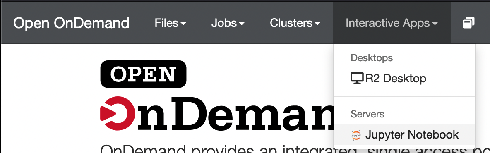
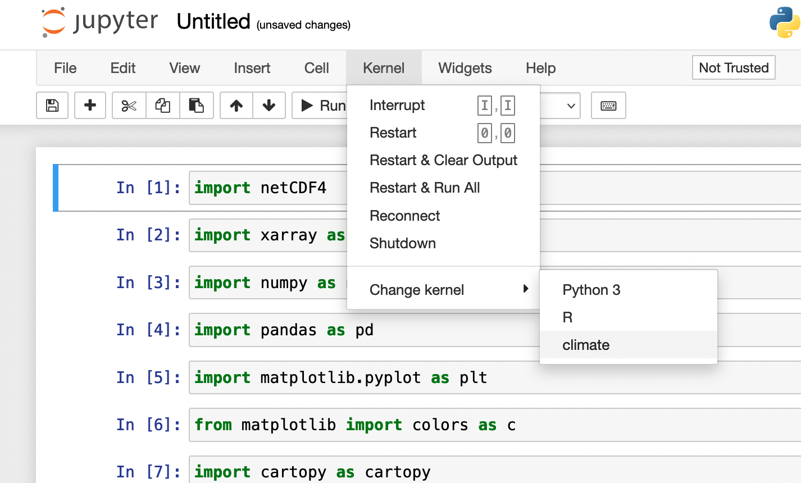

# Python

When using Python, you may find you need to use various libraries (e.g., numpy for numerical analysis or matplotlib for plotting).
Installing and managing these different libraries and their dependencies can be problematic, especially when you run into conflicts.
Conda and Mamba are package managers that help you create and navigate "environments" to help automatically handle these conflicts.
These environments can help you keep the python package versions needed for your different projects separate, which helps resolve dependency conflicts.
To learn more, we recommend this [introduction to conda](https://docs.conda.io/projects/conda/en/latest/user-guide/getting-started.html){:target="_blank"} or this [conda tutorial](https://carpentries-incubator.github.io/introduction-to-conda-for-data-scientists/){:target="_blank"}.
Mamba is, for the most part, a drop-in replacement for Conda, and is often much faster and better able to solve complex dependencies: [Mamba documentation](https://mamba.readthedocs.io){:target="_blank"}.
In the following tutorial, we will demonstrate how to install and use Mamba, but if you already have a conda installation via miniconda or another distribution, you can likely just replace `mamba` with `conda` in the commands.

## Installing Conda/Mamba

For managing python environments on the cluster, we recommend following the install instruction for Unix-like platforms provided by [Miniforge](https://github.com/conda-forge/miniforge#install){:target="_blank"}:
```bash
wget "https://github.com/conda-forge/miniforge/releases/latest/download/Miniforge3-$(uname)-$(uname -m).sh"
bash Miniforge3-$(uname)-$(uname -m).sh
```
The following prompt will ask whether you accept the license, if the default installation location (typically in your home directory) is alright (it is), and whether you want to initialize conda each time you log in (generally a good idea).
Once the install is finished, re-sourcing your bashrc will add the conda/mamba commands to your path:
```bash
. ~/.bashrc
```
At this point you should see the environment, `(base)`, appear at the front of your terminal prompt:
```
(base)[yourusername@borah-login ~]$
```

This lets you know that your "base" environment is active.

!!! info

    Using `mamba install` while your base environment is active will install packages into the base environment.

    It is good practice to *not* install any packages in your base environment but instead to create separate environments.

## Creating an environment

Now that you've installed mamba/conda, let's create an environment.

!!! warning

    Don't create conda environments or install packages on the login node.
    You can tell which node you're on by looking at your terminal prompt.
    If your prompt shows you are on the login node (e.g.,
    `[username@borah-login]$`), make sure to check out an interactive session
    using the command `dev-session` before installing.

The general command to create an environment is as follows:
```bash
mamba create -n ENVIRONMENTNAME -c CHANNEL PACKAGE1 PACKAGE2
```
The environment name can be whatever you like, the channel is one from
[Anaconda.org](https://anaconda.org/){:target="_blank"} (common channels are conda-forge or
bioconda), and the package names are whatever packages you want in that
environment. For example:

The following command creates an environment called "climate" that pulls from the conda-forge channel with the packages matplotlib and numpy:
```bash
mamba create -n climate -c conda-forge matplotlib numpy
```

Once this environment is created, it can be activated using the following command:
```bash
mamba activate climate
```

Conda/Mamba are powerful tools with many different options, to learn more check out the [conda user guide](https://docs.conda.io/projects/conda/en/latest/user-guide/index.html){:target="_blank"}.

## Creating an environment to work with the GPU

Many python packages distribute builds which can make use of the GPU through CUDA.
In order to build an environment which can use the GPU, we'll need to load these modules so that conda will detect CUDA to download the correct python package build.
Conda does this detection through [virtual packages](https://docs.conda.io/projects/conda/en/latest/user-guide/tasks/manage-virtual.html){:target="_blank"}, and you can see what virtual packages conda sees by running `conda info`.

First, check out a GPU node to prevent the conda environment creation step from getting killed on the login node and load CUDA module.
You can see all the available CUDA modules by running `module av cud`.
For machine learning applications (e.g., tensorflow or pytorch) you will want to use one of the "cudnn" modules, for other applications you may only need CUDA toolkit.
```bash
gpu-session
module load cudnn8.0-cuda11.0/8.0.5.39
```

Next, create your new environment using a create command as shown above.
You can verify that the package you've installed in the environment is built with GPU support by running `conda list` with the environment active.
An appropriate build will often have "gpu" or the CUDA version in the build tag.
For example the following output is from a pytorch environment built with CUDA11.2 support:


## Submitting jobs that use python in an environment

Following is an example script to submit a python job to the scheduler.

```bash title="conda-slurm.sh"
#!/bin/bash
#SBATCH -J python         # job name
#SBATCH -o log_slurm.o%j  # output and error file name (%j expands to jobID)
#SBATCH -n 1              # total number of tasks requested
#SBATCH -c 48             # CPU cores per task
#SBATCH -N 1              # number of nodes you want to run on
#SBATCH -p bsudfq         # queue (partition)
#SBATCH -t 12:00:00       # run time (hh:mm:ss) - 12.0 hours in this example.

# Activate the environment
# Replace environmentName with your environment name
. ~/.bashrc
conda activate environmentName

# Your code goes here
# Replace mypythonscript.py with the script you want to run
python mypythonscript.py
```

## Using an environment with Open OnDemand

[Open OnDemand](https://openondemand.org/){:target="_blank"} provides a
graphical interface to the cluster.
The OnDemand interface for Borah can be accessed at [ondemand.boisestate.edu](https://ondemand.boisestate.edu){:target="_blank"}.

In order to use your environment in a Jupyter Notebook through OnDemand, you'll
need to install some additional packages.
*With the environment you want to use activated*, install `ipykernel`:
```bash
mamba install ipykernel
```

Then run ipykernel to create the custom Jupyter kernel: (replace
        `ENVIRONMENT_NAME` with the environment name and `PYTHON ENV NAME` with
        the name you will select for the kernel)
```bash
python -m ipykernel install --user --name ENVIRONMENT_NAME --display-name "PYTHON ENV NAME"
```

Then navigate to the Jupyter Notebook App on [ondemand.boisestate.edu](https://ondemand.boisestate.edu){:target="_blank"}:



Once your Jupyter session starts, select the kernel you just made (It will be listed under the name you put in `PYTHON ENV NAME` the example below shows a kernel named "climate"):



## Moving your conda installation to scratch

Conda environments can get quite large and can exceed your home directory quota.
In this situation you may want to move your conda installation to your scratch.
You can relocate your `miniforge3` directory to your scratch space using the
following steps:

1. Make a `miniforge3` directory in your scratch space:
```bash
mkdir ~/scratch/miniforge3
```

2. Copy over your existing data. (This may take several minutes if your
        `miniforge3` directory is large.):
```bash
rsync -aAvP ~/miniforge3/* ~/scratch/miniforge3
```

3. Remove your current `miniforge3` directory:
```bash
rm -rf ~/miniforge3
```
4. Create a link to your new `miniforge3` directory:
```bash
ln -s ~/scratch/miniforge3 ~/miniforge3
```

And that's it--you can continue using conda as before!
