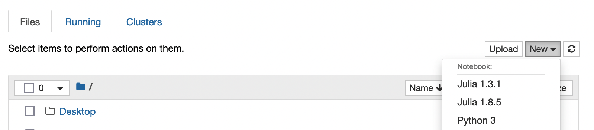

# Julia

This comprehensive guide will help you set up and use Julia, a high-level, high-performance programming language.

## Adding the Julia Kernel to OnDemand

[Open OnDemand](https://openondemand.org/){:target="_blank"} provides a graphical interface to the cluster, which provides an interactive user-interface for code development and testing.
The OnDemand interface for Borah is available at [ondemand.boisestate.edu](https://ondemand.boisestate.edu){:target="_blank"}

In order to use Julia in a Jupyter Notebook through OnDemand, you'll first need to install the IJulia kernel from the command line.

First, load any of the available Julia modules.
You can see the available modules using `module avail -i julia` and load the module using `module load julia/<version number here>`.
Next, load the Julia module, and open a Julia terminal:
```bash
module load julia
julia
```
After these commands, you'll see your prompt change to the Julia terminal:
```bash
julia>
```
Then in the Julia terminal, install the IJulia kernel:
```julia
using Pkg
Pkg.add("IJulia")
```
After this, the Julia kernel is installed for you.
(You'll only need to add the IJulia package once.)

Finally, to use Julia in a notebook, navigate to the Jupyter Notebook App on [ondemand.boisestate.edu](https://ondemand.boisestate.edu){:target="_blank"}.


Once your Jupyter session starts, select the Julia kernel:



## Julia Batch Script Example

Once you've developed and refined your Julia code, you may want to submit it as a batch submission to the scheduler.
Following is an example of how to do just that.

1. Create your script. The example below is called `hello_world.jl`:
```julia title="hello_world.jl"
print("Hello World")
```

2. Create your submission script. The example below is called `julia-slurm.sh`:
```bash title="julia-slurm.sh"
#!/bin/bash
#SBATCH -J julia            # job name
#SBATCH -o log_slurm.o%j    # output and error file name (%j expands to jobID)
#SBATCH -n 1                # total number of tasks requested
#SBATCH -N 1                # number of nodes you want to run on
#SBATCH --cpus-per-task 1
#SBATCH -p bsudfq           # queue (partition)
#SBATCH -t 12:00:00         # run time (hh:mm:ss)


# Load the Julia module
module load julia

# Run the example script
julia hello_world.jl
```

3. Submit to the scheduler
```bash
sbatch julia-slurm.sh
```

## Resources
- [Julia Documentation](https://docs.julialang.org/){:target="_blank"}: Comprehensive guides, tutorials, and references.
- [Julia By Example](https://juliabyexample.helpmanual.io/){:target="_blank"}: Practical examples of Julia programming.
- [Julia Discourse](https://discourse.julialang.org/){:target="_blank"}: Community forum to seek help, share ideas, and learn.
- [JuliaHub](https://juliahub.com/){:target="_blank"}: Platform hosting interactive Julia notebooks.
- [Julia Academy](https://juliaacademy.com/){:target="_blank"}: Online courses and tutorials to enhance your Julia skills.
