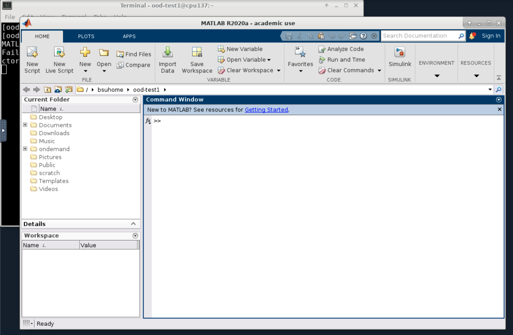

# MATLAB

MATLAB is a high-level language and interactive environment that enables you to perform computationally intensive tasks faster than with traditional programming languages.

1. Create a MATLAB Script

    First, you need to create a MATLAB script (a .m file) using any text editor. For this tutorial, we'll create a file named `myscript.m`:
```matlab title="myscript.m"
% MATLAB Script
disp('Hello, World!')

x = 5;
y = 6;
disp(x*y)
```

2. Submit your MATLAB job

    Create your submission script:
```bash title="matlab-slurm.sh"
#!/bin/bash
#SBATCH -J matlab           # job name
#SBATCH -o log_slurm.o%j    # output and error file name (%j expands to jobID)
#SBATCH -n 1                # total number of tasks requested
#SBATCH -N 1                # number of nodes you want to run on
#SBATCH --cpus-per-task 1
#SBATCH -p bsudfq           # queue (partition)
#SBATCH -t 12:00:00         # run time (hh:mm:ss)


# Load the MATLAB module
module load matlab

# Run the script
matlab -nodisplay -nosplash -nodesktop -r "run('myscript.m'); exit;"
```

    And submit this script using
```bash
sbatch matlab-slurm.sh
```

3. Check Output

    The output of the above job will be saved to a file called `log_slurm.o######` where `######` is replaced with the slurm job id. You should see something like the following in the output:
```
Hello, World!
30
```

## Using MATLAB in OnDemand

The OnDemand interface for Borah is available at [ondemand.boisestate.edu](https://ondemand.boisestate.edu){:target="_blank"}
After opening the terminal application on the desktop, here is an example of the commands to open MATLAB:
```bash
module load matlab
matlab
```
And the resulting MATLAB GUI will open in a new window as shown here:


## Resources

- [MATLAB Documentation](https://www.mathworks.com/help/matlab/){:target="_blank"}: Official documentaion
- [MATLAB Central](https://www.mathworks.com/matlabcentral/){:target="_blank"}: Forum to ask questions and learn from other MATLAB users and experts.
- [MATLAB Onramp](https://www.mathworks.com/learn/tutorials/matlab-onramp.html){:target="_blank"}: A free two-hour introductory tutorial that allows you to learn and practice using MATLAB interactively.
- [MATLAB Examples](https://www.mathworks.com/examples/matlab){:target="_blank"}: A collection of code examples for a variety of MATLAB functions.
