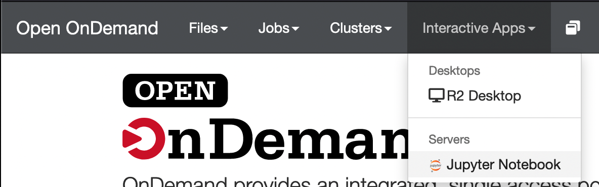
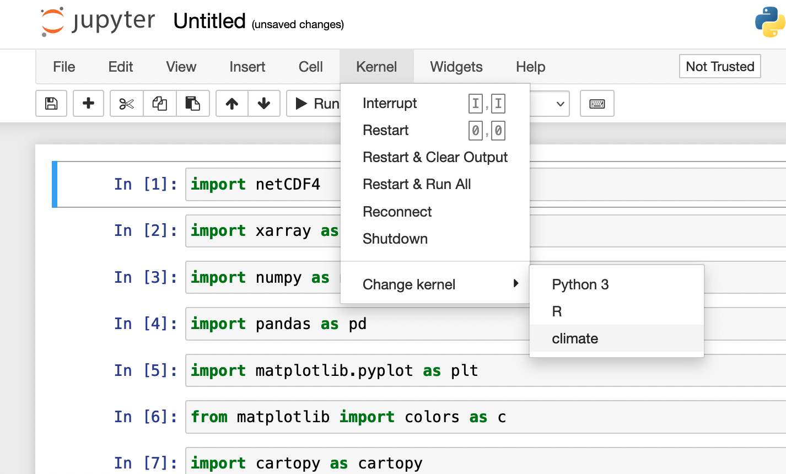

# Python

When using Python, you may find you need to use various libraries (e.g., numpy for numerical analysis or matplotlib for plotting).
Installing and managing these different libraries and their dependencies can be problematic, especially when you run into conflicts.
There are many package managers that help you create and navigate "environments" or "workspaces" to help automatically handle these conflicts.
These environments can help you keep the python package versions needed for your different projects separate, which helps resolve dependency conflicts.
To learn more, we recommend this [Pixi tutorial](https://pixi.prefix.dev/latest/python/tutorial){:target="_blank"},
[introduction to conda](https://docs.conda.io/projects/conda/en/latest/user-guide/getting-started.html){:target="_blank"},
or this [conda tutorial](https://carpentries-incubator.github.io/introduction-to-conda-for-data-scientists/){:target="_blank"}.

In the following tutorial, we will demonstrate how to install and use Pixi, but if you prefer a different python package manager (e.g., miniforge, micromamba), you are welcome to install that into your home directory and use it.
Here is a link to our previous [miniforge documentation](conda.md).

## Installing Pixi

For managing python environments on the cluster, we recommend following the install instruction for Unix-like platforms provided by [Pixi](https://pixi.prefix.dev/latest/installation){:target="_blank"}:

```bash
$ curl -fsSL https://pixi.sh/install.sh | sh
```

This will install the `pixi` binary into your home directory (in `/.pixi/bin`) and add a line to your shell configuration (`~/.bashrc`) that will add the `pixi` command to your environment.
Once the install is finished, re-sourcing your bashrc will allow you to use pixi:

```bash
$ source ~/.bashrc
```

You can confirm that pixi is in your environment by running:
```bash
$ pixi --version
```
If you see something like `pixi X.XX.X` where the `X`s are version numbers, you're good to go!


## Creating an environment

Now that you've installed pixi, let's create a workspace:

!!! warning

    Don't create workspaces or install packages on the login node.
    You can tell which node you're on by looking at your terminal prompt.
    If your prompt shows you are on the login node (e.g.,
    `[username@borah-login]$`), make sure to check out an interactive session
    using the command `dev-session` before installing.

The general command to create a workspace is as follows:

```bash
$ pixi init my_workspace
```
This will create a new directory called `my_workspace` with some files in it for pixi to track which packages should belong in this workspace.

If you already have an existing project directory, you can also initialize your pixi workspace there:
```bash
$ cd my_existing_directory
$ pixi init
```

Once the workspace is created, you can navigate to that directory and start building your environment:
```bash
$ cd my_workspace
```

To make sure that pixi grabs packages that work with Borah's OS, you'll need to pin the following virtual package:
```bash
$ pixi workspace platform edit --glibc 2.17 --linux 3.10.0 linux-64
```

Now you can add the packages you need:
```bash
$ pixi add numpy matplotlib
```

If you need to add a package from a different channel (e.g., pysam), you can add the channel to the workspace and then add the package:
```bash
$ pixi workspace channel add bioconda
$ pixi add pysam
```
You can see all available channels for a given package by searching the package name on
[Anaconda.org](https://anaconda.org/){:target="_blank"}
(common channels are conda-forge or bioconda).

If you need to add a package from [the Python Package Index (pypi.org)](https://pypi.org/), you can add it as follows:
```bash
$ pixi add python
$ pixi add requests --pypi
```

Once the workspace is created, it can be used by running one of the following commands from within the workspace directory:

```bash
$ pixi run python
```
or
```bash
$ pixi shell
$ python
```


## Creating a workspace to work with the GPU
### Notes about conda builds and virtual packages

Many python packages distribute builds which can make use of the GPU through
the CUDA api.
In order to build an environment which can use the GPU, pixi either needs to
be able to detect the CUDA version on the system or to be manually instructed
what CUDA version to use so that it can download the correct python package build.
This information is detected through
[virtual packages](https://pixi.prefix.dev/latest/advanced/explain_info_command/#virtual-packages){:target="_blank"}.

You can see what virtual packages exist by running `pixi info`.

For example if we run `pixi info` on a GPU node:

```bash
$ pixi info
```

```output hl_lines="9-10"
System
------------
       Pixi version: 0.81.0
        TLS backend: rustls
           Platform: linux-64
   Virtual packages: __unix=0=0
                   : __linux=3.10.0=0
                   : __glibc=2.17=0
                   : __cuda=12.4=0
                   : __cuda_arch=7.0=0
                   : __archspec=1=cascadelake
```

We can see in the output (highlighted above) that pixi detects a virtual CUDA
package.

It is also helpful to understand a little about the structure of a conda
package. When you pull a package from a conda channel, the naming convention is
`PACKAGENAME-VERSION-BUILD` for example <code><span style="color:blue">numpy</span>-<span style="color:orange">2.4.2</span>-<span style="color:green">py313</span>hfc84e54_1</code> is
the package, <span style="color:blue">NumPy</span>,
<span style="color:orange">version 2.4.2</span> built for
<span style="color:green">Python 3.13</span>. The rest of the build string contains other
information like the specific commit the package was built from, etc.

A GPU-capable build will often have `gpu` or `cuda` in the build tag.
For example, if you look at a GPU capable package on
[Anaconda](https://anaconda.org){:target="_blank"}, it's build tag might look
something like:
<code><span style="color:purple">cuda129</span>py312h7ab20fb_200</code>
where <code><span style="color:purple">cuda129</span></code> tells us this
package is built for <span style="color:purple">CUDA version 12.9</span>.

### Building a GPU-capable environment

1. First, check out an interactive session to prevent the conda environment
    creation step from getting killed on the login node:

    ```bash
    $ gpu-session
    ```

    If this command is taking a while, it might mean all the available nodes
    are in use, so you can also try `gpu-session-l40` or `dev-session`.

    !!! info
        If you use `dev-session`, which starts an interactive session on a node
        without GPU, you'll need to run
        `pixi workspace platform edit --cuda 12 --glibc 2.17 --linux 3.10.0 linux-64`
        or, if you've already pinned glibc 2.17 and linux 3.10.0,
        `pixi workspace platform edit --cuda 12 linux-64-glibc-2-17-linux-3-10-0`
        before creating your environment.
        You can see the existing platforms in your environment by running
        `pixi workspace platform list`.

2. Create your new environment specifying a "cuda" or "gpu" build:

    ```bash
    $ pixi add "pytorch=*=cuda*"
    ```
    or
    ```bash
    $ pixi add "tensorflow=*=cuda*"
    ```

    The above command tells pixi to grab the package "tensorflow" or "pytorch",
    any version, and any build that starts with "cuda".

3. Activate your environment and confirm that your package was installed
   correctly:

    Make sure you're on a GPU node and in your workspace directory.

    ```bash
    $ gpu-session
    $ cd my_workspace
    ```

    To check if PyTorch can use the GPU:

    ```bash
    $ pixi run python -c "import torch; print(torch.cuda.is_available())"
    ```

    To check if TensorFlow can use the GPU:

    ```bash
    $ pixi run python -c "import tensorflow as tf; print(tf.test.is_built_with_cuda())"
    ```

    If your pytorch/tensorflow installation is built with cuda, both of those
    lines should print "True".

And that's it! Your workspace is ready to use the GPU.

## Submitting jobs that use python in an environment

Following is an example script to submit a python job to the scheduler.


```bash title="conda-slurm.sh"
#!/bin/bash
#SBATCH -J python         # job name
#SBATCH -o log_slurm.o%j  # output and error file name (%j expands to jobID)
#SBATCH -n 1              # total number of tasks requested
#SBATCH -c 48             # CPU cores per task
#SBATCH -N 1              # number of nodes you want to run on
#SBATCH -p bsudfq         # queue (partition)
#SBATCH -t 12:00:00       # run time (hh:mm:ss) - 12.0 hours in this example.

# Activate the environment
# Replace environmentName with your environment name
. ~/.bashrc
cd my_workspace

# Your code goes here
# Replace mypythonscript.py with the script you want to run
pixi run python mypythonscript.py
```

## Using an environment with Open OnDemand

[Open OnDemand](https://openondemand.org/){:target="_blank"} provides a
graphical interface to the cluster.
The OnDemand interface for Borah can be accessed at [ondemand.boisestate.edu](https://ondemand.boisestate.edu){:target="_blank"}.

In order to use your environment in a Jupyter Notebook through OnDemand, you'll
need to install some additional packages.
*With the environment you want to use activated*, install `ipykernel`:

```bash
$ pixi add ipykernel
```


Then run ipykernel to create the custom Jupyter kernel: (replace
`ENVIRONMENT_NAME` with the environment name and `PYTHON ENV NAME` with
the name you will select for the kernel)

```bash
$ pixi run python -m ipykernel install --user --name ENVIRONMENT_NAME --display-name "PYTHON ENV NAME"
```

Then navigate to the Jupyter Notebook App on [ondemand.boisestate.edu](https://ondemand.boisestate.edu){:target="_blank"}:



Once your Jupyter session starts, select the kernel you just made (It will be listed under the name you put in `PYTHON ENV NAME` the example below shows a kernel named "climate"):



